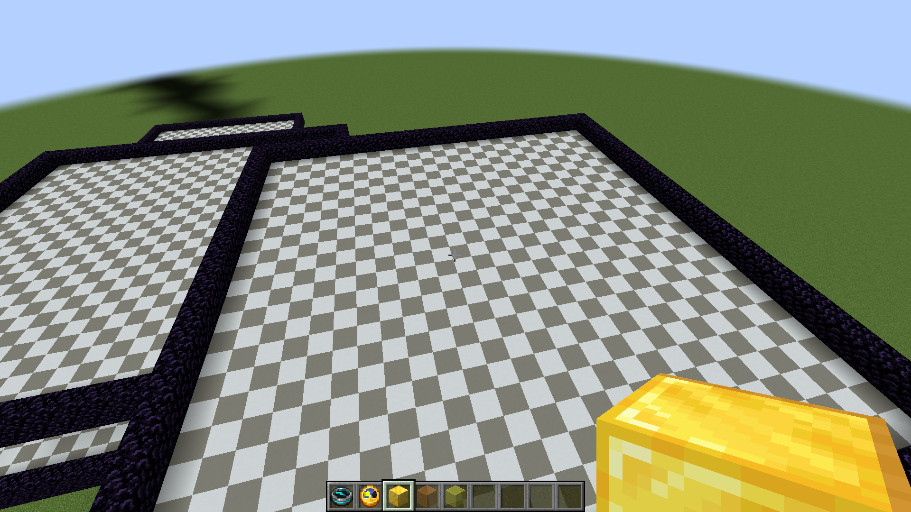
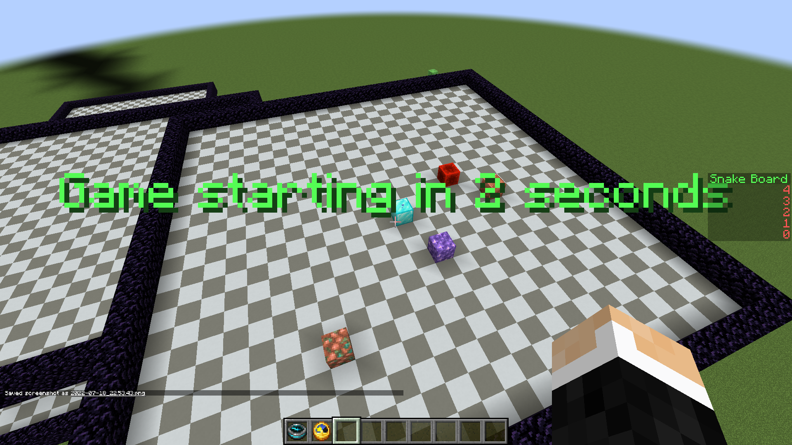
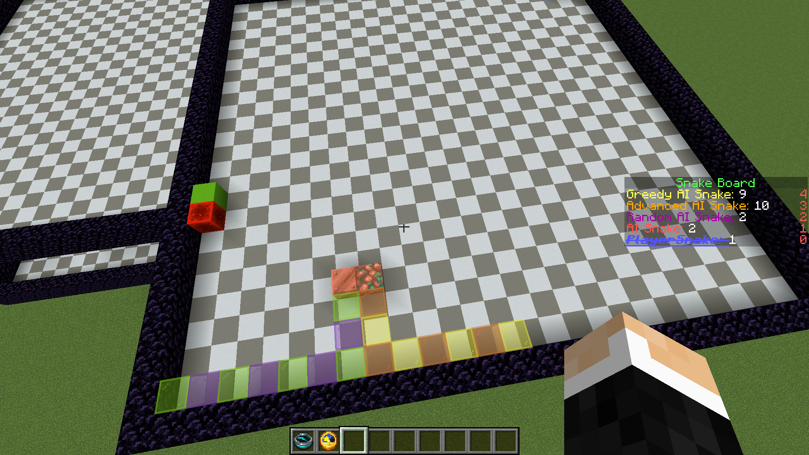
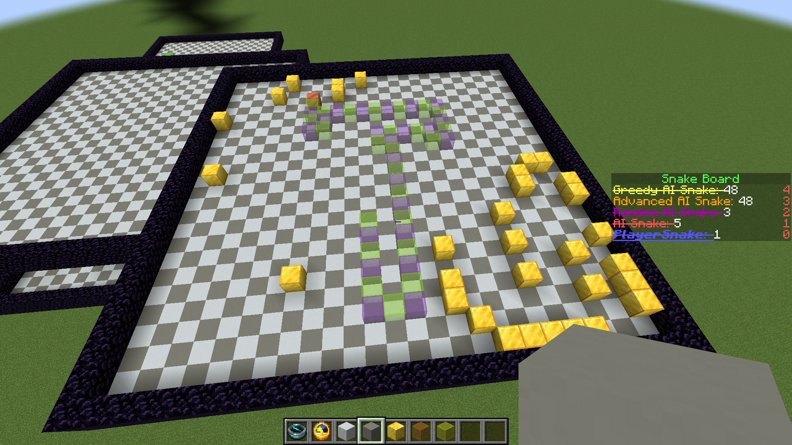

#Snake Game Plugin

## Sections
- [Snake Plugin](#snake-game-plugin)
  - [Game Mechanics](#game-mechanics)
    - [Snake AI](#snake-ai)
    - [Screenshots](#screenshots)
    - [Controls](#controls)
    - [Commands](#commands)
  - [Commands](#commands)
  - [Issues](#Issues)
## Game Mechanics
This is a snake game in Minecraft using the command to start and end. As a player, you can control the snake with a diamond head using a recovery compass and clock while completing different levels of AI snakes.

### Snake AI
There are five different AI in this game:
1. The basic AI:
   1. Moving forward most of the time and only turn around when they're facing obstacles.
2. The random AI:
   1. Same as the basic AI but with some random turns.
3. The advanced AI:
   1. Using A* algorithm to find the shortest path to the closest food source. Once the goal is set, it can not be changed unless the food is consumed.
4. The greedy AI:
   2. Using A* algorithm like before, but allow to change the goal when there is a better food source.
5. The Hamiltonian cycle AI:
   1. Trying to find a Hamiltonian cycle to visit as many nodes as possible, but it takes a long time and may crash the server.

### Screenshots
Some in-game screenshots




### Controls
#### Recovery Compass

>Left-click the compass to turn left, which is relative to the direction of the head of the snake.

>Right-click the compass to turn right, which is relative to the direction of the head of the snake.
#### Clock

>Left-click the clock to toggle on or off the acceleration of the snake, which will speed up the snake by consuming the size.
### Commands
> Game controls:
```/snake game init```
```/snake game start```
```/snake game end```
```/snake game pause```
```/snake game resume```

> Arena controls:
```/snake arena build <SMALL || MEDIUM || LARGE >```
```/snake arena clear```

## compile
>Download the source and open it as a maven project. Then, build or install it to create the jar file and a folder of config files.
If you want to jar file directly, feel free to contact [My discord server][discord]
## Issues
It is not optimised, and the Hamiltonian AI snake will sometime crash the server.

[discord]: https://discord.com/channels/874340350062362681/874340350062362684